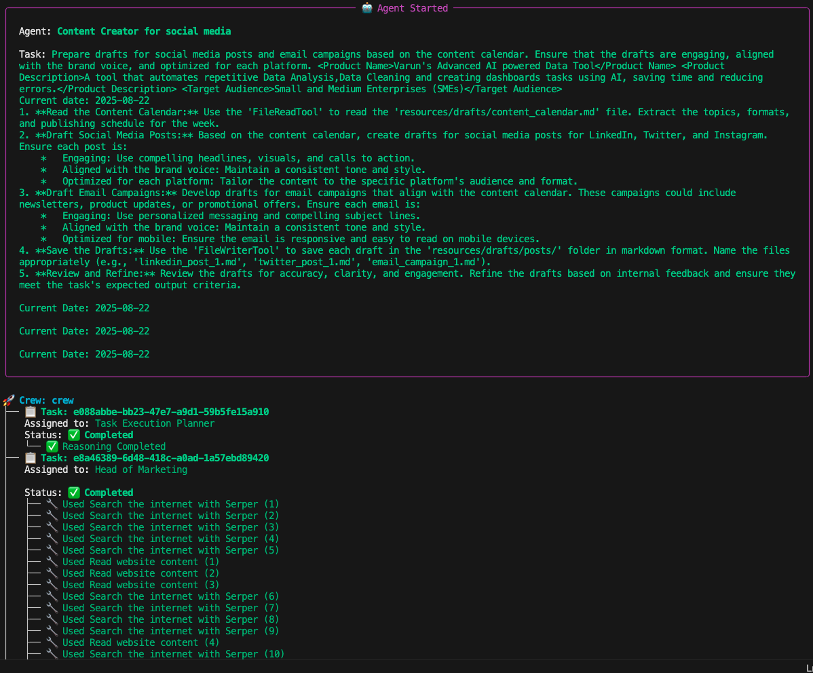

# CrewAI Marketing Automation Team

## About This Project

This is a personal project where I built an automated marketing workflow using CrewAI. The main goal is to create a smart, modular team of AI agents that can handle all the typical marketing tasks you'd find in a real team—like market research, strategy planning, content creation, and SEO—without much manual effort.

The product used in the workflow is just a placeholder. The real focus is on how these agents work together, pass information, and produce useful outputs.

---

## What’s Inside

- **A team of AI agents**: Each agent has a specific role (Head of Marketing, Content Creator, Blog Writer, SEO Specialist).
- **Automated workflow**: Agents collaborate to complete tasks like research, strategy, content calendar, social posts, blogs, and SEO.
- **Easy configuration**: All agent roles and tasks are defined in YAML files, so you can tweak things without touching the code.
- **Organized outputs**: Everything the agents produce is saved as markdown files for easy review.

---

## How It Works

- **Agents** are defined in `config/agents.yaml` with their roles, goals, and tools.
- **Tasks** are set up in `config/tasks.yaml`—each with a description and where the output should go.
- **crew.py** is the main script that runs the whole workflow.
- **Outputs** are saved in the `resources/drafts/` folder, organized by type (strategy, calendar, posts, reels, blogs).

---

## Directory Structure

```
marketing_crew/
├── crew.py
├── config/
│   ├── agents.yaml
│   └── tasks.yaml
├── resources/
│   └── drafts/
│       ├── content_calendar.md
│       ├── marketing_strategy.md
│       ├── posts/
│       ├── reels/
│       └── blogs/
├── .env
├── response.md
```

---

## The Agents

- **Head of Marketing**: Leads research and strategy.
- **Content Creator (Social Media)**: Makes social posts, emails, and reels.
- **Content Writer (Blogs)**: Researches and writes blog posts.
- **SEO Specialist**: Optimizes blog content for search engines.

---

## The Workflow

1. Market Research
2. Marketing Strategy
3. Content Calendar
4. Social/Email Drafts
5. Reel Scripts
6. Blog Research
7. Blog Drafts
8. SEO Optimization

Each step builds on the previous one, and the outputs are saved as markdown files.

---

## How to Use

### Requirements

- Python 3.8 or newer
- Install dependencies:
  ```sh
  pip install crewai crewai_tools pydantic python-dotenv
  ```
- Add your API keys to a `.env` file.

### Running the Project

1. If you want, edit the agent and task YAML files to change roles or instructions.
2. Run the main script:
   ```sh
   python crew.py
   ```
3. Check the `resources/drafts/` folder for all the outputs.

---

## Example Outputs

- `resources/drafts/marketing_strategy.md`: The marketing strategy
- `resources/drafts/content_calendar.md`: The weekly content calendar
- `resources/drafts/posts/`: Social media and email drafts
- `resources/drafts/reels/`: Instagram reel scripts
- `resources/drafts/blogs/`: Blog drafts and SEO-optimized blogs

---

## Troubleshooting

- If something’s missing, check `response.md` for feedback from the agents.
- Make sure your YAML files are formatted correctly and all folders exist.

---
## Agent At Work


---

## License

MIT License
